# Use Case Diagram - SI Penjualan (Sales Information System)

## Overview
SI Penjualan is an e-commerce application for managing products, categories, brands, sizes, photos, promotional codes, and customer transactions.

## Actors

### 1. Customer (Pelanggan)
The end-user who browses products and makes purchases through the e-commerce platform.

### 2. Admin
The system administrator who manages the entire e-commerce platform including products, categories, brands, promo codes, and transactions.

---

## Use Case Diagram

```mermaid
graph TB
    subgraph "SI Penjualan E-Commerce System"
        subgraph "Product Management"
            UC1[Manage Products]
            UC2[Manage Categories]
            UC3[Manage Brands]
            UC4[Manage Product Photos]
            UC5[Manage Product Sizes]
        end
        
        subgraph "Shopping Features"
            UC6[Browse Products]
            UC7[View Product Details]
            UC8[Filter by Category]
            UC9[Filter by Brand]
            UC10[View Popular Products]
        end
        
        subgraph "Transaction Management"
            UC11[Create Transaction/Booking]
            UC12[Apply Promo Code]
            UC13[Upload Payment Proof]
            UC14[View Transaction Status]
            UC15[Process Payment]
        end
        
        subgraph "Promotion Management"
            UC16[Manage Promo Codes]
            UC17[View Discount Details]
        end
    end
    
    Customer((Customer<br/>Pelanggan))
    Admin((Admin))
    
    %% Customer interactions
    Customer --> UC6
    Customer --> UC7
    Customer --> UC8
    Customer --> UC9
    Customer --> UC10
    Customer --> UC11
    Customer --> UC12
    Customer --> UC13
    Customer --> UC14
    Customer --> UC17
    
    %% Admin interactions
    Admin --> UC1
    Admin --> UC2
    Admin --> UC3
    Admin --> UC4
    Admin --> UC5
    Admin --> UC16
    Admin --> UC15
    Admin --> UC14
    
    %% Use case dependencies
    UC7 -.includes.-> UC4
    UC7 -.includes.-> UC5
    UC11 -.extends.-> UC12
    UC11 -.includes.-> UC17
    UC1 -.includes.-> UC4
    UC1 -.includes.-> UC5
    
    style Customer fill:#4A90E2
    style Admin fill:#E27A4A
```

---

## Use Case Descriptions

### Customer Use Cases

#### UC6: Browse Products
- **Actor**: Customer
- **Description**: Customer can browse all available products in the system
- **Precondition**: Products exist in the database
- **Postcondition**: Customer sees list of products with thumbnails, names, and prices

#### UC7: View Product Details
- **Actor**: Customer
- **Description**: Customer can view detailed information about a specific product including multiple photos, available sizes, description, price, stock, brand, and category
- **Includes**: UC4 (Product Photos), UC5 (Product Sizes)
- **Precondition**: Product exists in the system
- **Postcondition**: Customer sees complete product information

#### UC8: Filter by Category
- **Actor**: Customer
- **Description**: Customer can filter products by specific category (e.g., Shoes, Clothing)
- **Precondition**: Categories exist in the system
- **Postcondition**: Customer sees products only from selected category

#### UC9: Filter by Brand
- **Actor**: Customer
- **Description**: Customer can filter products by specific brand (e.g., Nike, Adidas)
- **Precondition**: Brands exist in the system
- **Postcondition**: Customer sees products only from selected brand

#### UC10: View Popular Products
- **Actor**: Customer
- **Description**: Customer can view products marked as popular/featured
- **Precondition**: Products with is_popular flag exist
- **Postcondition**: Customer sees featured/popular products

#### UC11: Create Transaction/Booking
- **Actor**: Customer
- **Description**: Customer creates a purchase transaction by providing personal information, delivery address, selecting product size, quantity, and applying optional promo code
- **Precondition**: Product has sufficient stock
- **Postcondition**: Transaction is created with unique booking ID (TJH-prefixed)
- **Extends**: UC12 (Apply Promo Code)
- **Includes**: UC17 (View Discount Details)

#### UC12: Apply Promo Code
- **Actor**: Customer
- **Description**: Customer applies a promotional code during checkout to receive discount
- **Precondition**: Valid promo code exists
- **Postcondition**: Discount is applied to transaction total

#### UC13: Upload Payment Proof
- **Actor**: Customer
- **Description**: Customer uploads proof of payment (image) for transaction verification
- **Precondition**: Transaction exists and is unpaid
- **Postcondition**: Payment proof is attached to transaction

#### UC14: View Transaction Status
- **Actor**: Customer, Admin
- **Description**: View transaction details including payment status, total amount, and order information
- **Precondition**: Transaction exists
- **Postcondition**: Transaction details are displayed

#### UC17: View Discount Details
- **Actor**: Customer
- **Description**: Customer can see discount amount when promo code is applied
- **Precondition**: Promo code is applied to transaction
- **Postcondition**: Discount details are displayed

---

### Admin Use Cases

#### UC1: Manage Products
- **Actor**: Admin
- **Description**: Admin can create, read, update, and delete products including setting name, price, stock, description, thumbnail, category, brand, and popular flag
- **Includes**: UC4 (Product Photos), UC5 (Product Sizes)
- **Precondition**: Admin is authenticated
- **Postcondition**: Product is created/updated/deleted with soft delete support

#### UC2: Manage Categories
- **Actor**: Admin
- **Description**: Admin can create, read, update, and delete product categories with icons
- **Precondition**: Admin is authenticated
- **Postcondition**: Category is created/updated/deleted with auto-generated slug

#### UC3: Manage Brands
- **Actor**: Admin
- **Description**: Admin can create, read, update, and delete product brands with logos
- **Precondition**: Admin is authenticated
- **Postcondition**: Brand is created/updated/deleted with auto-generated slug

#### UC4: Manage Product Photos
- **Actor**: Admin
- **Description**: Admin can add, update, or remove multiple photos for a product
- **Precondition**: Product exists
- **Postcondition**: Product photos are managed

#### UC5: Manage Product Sizes
- **Actor**: Admin
- **Description**: Admin can add, update, or remove available sizes for a product
- **Precondition**: Product exists
- **Postcondition**: Product sizes are managed

#### UC16: Manage Promo Codes
- **Actor**: Admin
- **Description**: Admin can create, read, update, and delete promotional codes with discount amounts
- **Precondition**: Admin is authenticated
- **Postcondition**: Promo code is created/updated/deleted with soft delete support

#### UC15: Process Payment
- **Actor**: Admin
- **Description**: Admin verifies payment proof and updates transaction status to paid
- **Precondition**: Transaction exists with payment proof
- **Postcondition**: Transaction is_paid flag is updated

---

## Main Features Summary

### 1. Product Catalog Management
- Multi-dimensional product organization (by Category, Brand, Popularity)
- Rich product information (photos, sizes, descriptions, pricing, stock)
- Automatic slug generation for SEO-friendly URLs
- Soft delete support for data preservation

### 2. Shopping Experience
- Product browsing and filtering capabilities
- Detailed product views with gallery and size selection
- Popular/featured products showcase
- Category and brand-based navigation

### 3. Transaction System
- Unique transaction ID generation (TJH-prefix)
- Complete customer information capture (name, email, phone, address, postal code, city)
- Product quantity and size selection
- Automatic price calculation (subtotal, discount, grand total)
- Payment proof upload functionality
- Transaction status tracking

### 4. Promotional System
- Flexible promo code management
- Fixed-amount discount application
- Discount calculation in transactions
- Optional promo code usage

### 5. Data Management
- Soft delete implementation across all entities
- Relationship integrity with foreign keys
- Automatic slug generation for categories, brands, and products
- Factory and seeding support for testing

---

## Technical Architecture Highlights

### Database Design
- **Main Entities**: Produk, Category, Brand, ProductTransaction, PromoCode, ProdukPhoto, ProdukSize
- **Key Relationships**:
  - Product belongs to Category and Brand
  - Product has many Photos and Sizes
  - Transaction belongs to Product and optionally PromoCode
- **Features**: Soft deletes, unique transaction IDs, foreign key constraints with cascade delete

### Application Features
- Laravel 12 framework
- Eloquent ORM for database operations
- Factory pattern for testing
- RESTful architecture ready
- Blade templating system
- Vite for asset compilation
